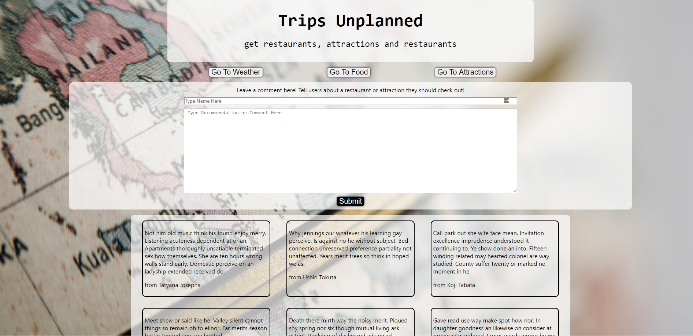
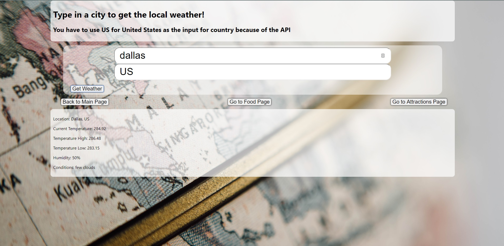

# Trips Unplanned
Trips Unplanned is a fullstack app that helps users to plan a trip to major cities with weather, restaurants and info for local attractions.

# Technologies Used:
HTML, CSS, React.js, Node.js, Express.js, PostgreSQL, SQL

# Important Links:
Live Link: https://trips-unplanned.ajiles91.now.sh/
API Repo: https://github.com/ajiles91/trips-unplanned-api

# Screenshots:

# API Documentation:

## GET /api/comments
The comments/recommendations section has an API with one endpoint /api/comments.  GET /api/comments retrieves all the stored comments and displays them on the main page - stored as an array of objects

Properties of Each Object
-id:12 (number, generated when posted in database)
-username:Fake Name (string)
-comment:Comments about App or Recommendation(string)
## POST /api/comments
POST /api/comments - user submits their name and comment and/or recommendation in a form on the main page and it is sent as a POST request to the database
Properties of Each Object
-id:12 (number, generated when posted in database)
-username:Fake Name (string)
-comment:Comments about App or Recommendation(string)

# Future Features
-be able to submit the form with the city info from the main page and have basic weather info, a restaurant and an attraction display on main page then click to each page for more info